# AWSにおけるコンテナ関連サービス

AWSのコンテナ関連サービスの一覧。

|  名前 | 種類 | 説明 |
| --- | --- | --- |
|  ECR | レジストリ | Dockerイメージレジストリ |
|  ECS | コントロールプレーン | AWSフルマネージドコンテナコントロールプレーン |
|  EKS | コントロールプレーン | Kubernetes互換のコンテナコントロールプレーン |
|  Fargate | データプレーン | AWSフルマネージドのコンテナ専用コンピューティングサービス。ホストOSの管理が一切不要。 |

# AWSのコンテナサービスを理解するために必須な用語「コントロールプレーンとデータプレーン」

AWSのコンテナサービスを理解する上で一番重要なのは、コントロールプレーンとデータプレーンの違いです。ここを必ず抑えておいてください。

コントロールプレーンの主な役割は**コンテナの管理**です。具体的には、コンテナが動作するネットワーク（VPC, Subnet, Load Balancer, Security Group）や、コンテナの死活監視、自動復旧、負荷に応じたスケーリングなどを行います。

対してデータプレーンの主な役割は**コンテナが稼働する場所**です。コントロールプレーンからの指示にしたがって起動し、コンピューティングリソースを消費し、コンテナの状態をコントロールプレーンに通知します。

この2つの関係性を図示するとこうなります。

4つの組み合わせの呼称はこうなります。

- ECS on EC2
- ECS on Fargate
- EKS on EC2
- EKS on Fargate

